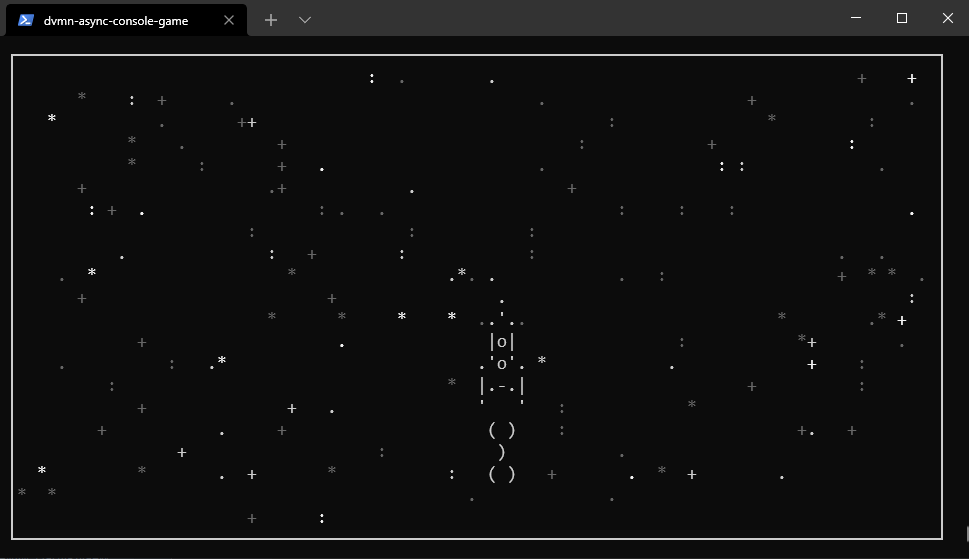

# Консольная игра про уничтожение мусора на орбите Земли

<div align="center">
  
</div>

Написана с использованием асинхронных возможностей языка Python.

* Игра начинается с 1957 года.
* С 1961 года начинает падать космический мусор, от которого необходимо уворачиваться.
* С 2020 года игрок получает плазменную пушку и может уничтожать падающий космический мусор.
* Игра длится до тех пор, пока корабль не столкнётся с мусором.


## Установка

Для корректной работы игры необходимо установить [Python 3.10.12](https://www.python.org/downloads/release/python-31012/) и запускать игру на Linux.
1. Скачайте код из репозитория.
2. Запустите код
   ```sh
   python3 main.py
   ```

***

Код написан в образовательных целях на онлайн-курсе для веб-разработчиков [Devman](dvmn.org).